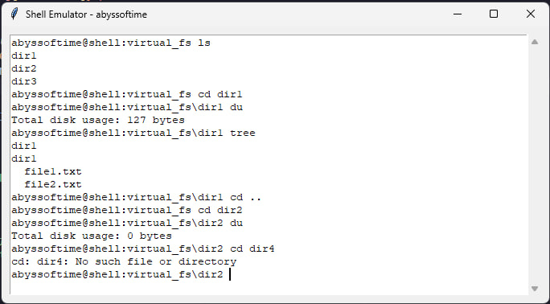

# Эмулятор для оболочки языка OS

## 1. Общее описание

Этот проект представляет собой эмулятор оболочки языка OS, реализованный на Python. Эмулятор поддерживает базовые команды командной строки, такие как ls, cd, du, tree, clear и exit. Виртуальная файловая система загружается из архива tar.

### Основные особенности:
- Эмуляция команд UNIX-подобной оболочки.
- Поддержка виртуальной файловой системы, загружаемой из архива tar.
- Работа в режиме GUI
- Поддержка базовых команд для работы с файлами и директориями.

### Структура проекта:
```css
homework1/
├── other/
│   ├── confid.json  # Конфигурационный файл
│   └── virtual_fs.tar # Виртуальная файловая система
├── emulator.py # class Emulator
├── main.py # Осноной файл эмулятора
├── test_emulator.py # Тестирование работы эмулятора
```

## 2. Описание всех функций и настроек

### Класс Emulator

### `__init__(self, config, output_widget)`

### Функция-конструктор.

- **Аргументы:**
  - `config:` Словарь с настройками (например, путь к архиву файловой системы, имя пользователя).
  - `output_widget:` Графический виджет, в который выводятся результаты выполнения команд.
- **Действия:**
  - Загружает виртуальную файловую систему из архива, путь к которому указан в config['fs_image'].
  - Устанавливает начальный каталог как корневой каталог виртуальной файловой системы.
 
### `load_virtual_fs(self, fs_image_path)`

### Загружает виртуальную файловую систему.

- **Аргументы:**
  - `fs_image_path:` Путь к архиву с образом виртуальной файловой системы.
- **Действия:**
  - Распаковывает архив с помощью модуля tarfile в каталог virtual_fs.
  - Возвращает путь к распакованной файловой системе.

### `execute_command(self, command)`

### Обрабатывает вводимую пользователем команду.

- **Аргументы:**
  - `command:` Строка, содержащая введённую пользователем команду.
- **Действия:**
  - 1. Убирает лишние пробелы в начале и конце команды.
  - 2. Если команда пустая, выводит новое приглашение (строку-подсказку для ввода).
  - 3. Разделяет команду на слова и извлекает первую часть как название команды (cmd).
  - 4. Вызывает соответствующий метод на основе введённой команды:
    - `ls:` Показать содержимое текущего каталога.
    - `cd:` Перейти в другой каталог.
    - `exit:` Выйти из оболочки.
    - `du:` Посчитать размер текущего каталога.
    - `tree:` Показать дерево каталогов и файлов.
    - `clear:` Очистить экран.
    - В случае неизвестной команды сообщает об ошибке.
   
### `ls(self)`

### Выводит содержимое текущего каталога.

- **Действия:**
  - Получает список всех файлов и папок в текущем каталоге с помощью os.listdir.
  - Выводит список в output_widget, разделяя элементы символом новой строки.
  - Если каталог не найден, выводит сообщение об ошибке.

 ### **cd(self, args)**

### Переходит в указанный каталог.

- **Аргументы:**
  - `args:` Список аргументов команды, где второй элемент — путь, в который нужно перейти.
- **Действия:**
  - Проверяет, указан ли путь (args[1]), и выводит ошибку, если нет.
  - Если путь — .., переходит в родительский каталог, но не выходит за пределы виртуальной файловой системы.
  - Если указан другой путь, проверяет, существует ли каталог, и изменяет текущий путь, если он валиден.
  - Если переход невозможен (путь неверный или за пределами файловой системы), выводит сообщение об ошибке.
 
### `exit_shell(self)`

### Выходит из оболочки.

- **Действия:**
  - Выводит сообщение "Exiting shell...".
  - Закрывает приложение, вызывая self.output_widget.quit().
 
### `du(self)`

### Выводит общий размер текущего каталога (в байтах).

- **Действия:**
  - Рекурсивно проходит по всем файлам и каталогам в текущем каталоге с помощью os.walk.
  - Суммирует размеры всех файлов с помощью os.path.getsize.
  - Выводит итоговый размер в output_widget.
 
### `tree(self)`

### Рекурсивно выводит структуру текущего каталога.

- **Действия:**
  - Выводит имя текущего каталога.
  - Рекурсивно вызывает вложенную функцию print_tree:
  - Для каждого подкаталога и файла выводит имя с отступом (indent), чтобы отобразить иерархию.
  - Использует сортировку списка для предсказуемого порядка вывода.


### `clear(self)`

### Очищает экран оболочки.

- **Действия:**
  - Удаляет все содержимое виджета output_widget вызовом delete(1.0, "end").
 
### Поток выполнения
- 1. Начальная настройка: Конструктор загружает виртуальную файловую систему.
- 2. Обработка команд: Метод execute_command определяет, какую команду вызвал пользователь, и передаёт управление соответствующему методу.
- 3. Команды оболочки:
  - `ls:` Показывает содержимое каталога.
  - `cd:` Меняет текущий каталог.
  - `du`: Выводит общий размер файлов.
   -`tree:` Строит дерево каталогов.
   -`clear:` Очищает экран.
  - `exit:` Завершает работу.

### `load_config()`

Загружает конфигурационный файл.

- **Действия:**

  - Открывает JSON-файл по фиксированному пути: "C:/Users/Ultre/Documents/hw_1/other/config.json".
  - Загружает содержимое файла в словарь с помощью json.load.
  - Возвращает этот словарь.

- **Назначение:** Передать конфигурационные параметры (например, имя пользователя, путь к файловой системе) в эмулятор оболочки.

### `run_gui(config)`

Создаёт графический интерфейс и запускает эмулятор оболочки.

- **Аргументы:**

  - `config:` Словарь конфигурации, загружаемый из load_config.

- **Действия:**

  - **1.** Инициализация интерфейса:

    - Создаёт окно с помощью библиотеки tkinter.
    - Устанавливает заголовок окна в формате "Shell Emulator - <username>".
    - Создаёт текстовое поле (ScrolledText) для отображения вывода и ввода команд.
    - Добавляет текстовое поле на интерфейс.
  - **2.** Инициализация эмулятора:

    - Создаёт экземпляр класса Emulator, передавая ему конфигурацию и текстовое поле для вывода результата.

  - **3.** Функции интерфейса:

    - `get_prompt()`
      - Возвращает строку приглашения в формате <username>@shell:<текущий каталог>.
      - Использует текущий каталог из emulator.current_dir.
    - `print_prompt()
      - Выводит строку приглашения в текстовое поле.
      - Перемещает курсор ввода в конец текста.
    - `on_enter_pressed(event)`
      - Обрабатывает нажатие клавиши Enter:
        - Получает текущую строку, введённую пользователем (приглашение и команда).
        - Извлекает команду, обрезая строку приглашения.
        - Если команда не пуста, передаёт её в метод emulator.execute_command для выполнения.
        - Выводит результат выполнения команды и добавляет новую строку приглашения.
        - Возвращает "break", чтобы предотвратить добавление новой строки в поле.
  
    - **4.** Привязка событий:

      - Привязывает обработчик on_enter_pressed к клавише Enter.
      - Устанавливает фокус на текстовом поле для удобства пользователя.

    - **5.** Запуск интерфейса:

      - Вызовом `root.mainloop()` запускает цикл обработки событий, что позволяет взаимодействовать с интерфейсом.

### `if __name__ == "__main__":`

Точка входа в программу.

  - **Действия:**

    - Вызывает `load_config()` для загрузки конфигурации.
    - Передаёт загруженную конфигурацию в функцию `run_gui` для запуска интерфейса.
  
### **Поток выполнения**
  - **1.** При запуске программы вызывается функция load_config, которая загружает конфигурацию из JSON-файла.
  - **2.** Функция run_gui создаёт графический интерфейс:
    - Отображает текстовое поле для взаимодействия с оболочкой.
    - Устанавливает начальное приглашение.
    - Привязывает обработчик событий для ввода команд.
  - **3.** Пользователь вводит команду в текстовом поле и нажимает Enter:
    - Система извлекает введённую команду.
    - Эмулятор выполняет команду.
    - Выводится результат выполнения, а затем новое приглашение.
  - **4.** Интерфейс остаётся активным, пока пользователь явно не закроет окно.

### **Связь с классом Emulator**

- Функция `run_gui` обеспечивает взаимодействие пользователя с классом Emulator через графический интерфейс.
- Метод `execute_command` вызывается из обработчика `on_enter_pressed` для выполнения команд, а результат выводится в текстовое поле.

## 3. Описание команд для сборки проекта

Для работы с проектом необходимо иметь установленный Python 3.12

### Клонирование репозитория:

```bash
git clone https://github.com/VadimAot/skvCM.git
cd skvCM
```

### Запуск эмулятора:
```bash
python main.py
```

## 4. Пример использования:



## 5. Результаты прогона тестов:

