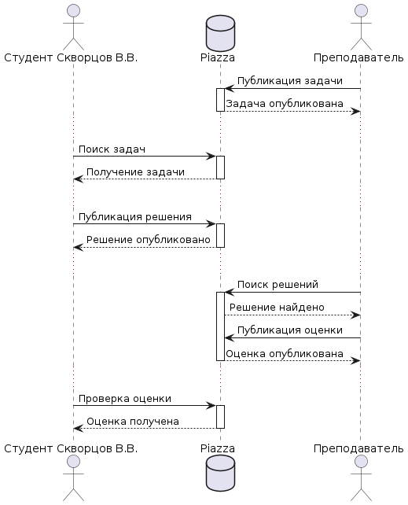

# Скворцов Вадим ИКБО-63-23
# Практическое занятие №7. Генераторы документации

П.Н. Советов, РТУ МИРЭА

## Задача 1

Реализовать с помощью математического языка LaTeX нижеприведенную формулу:


Прислать код на LaTeX и картинку-результат, где, помимо формулы, будет указано ФИО студента.

## Решение

```LaTeX
\documentclass{article}
\usepackage[utf8]{inputenc}
\usepackage[russian]{babel}
\usepackage{amsmath}
\usepackage[T2A]{fontenc}
\begin{document}


\[
\int_{x}^{\infty} \frac{dt}{t(t^2 - 1) \log t} = \int_{x}^{\infty} \frac{1}{t \log t} \left( \sum_{m=1}^{\infty} t^{-2m} \right) dt = \sum_{m=1}^{\infty} \int_{x}^{\infty} \frac{t^{-2m}}{t \log t} dt = \sum_{m=1}^{\infty} \operatorname{li}(x^{-2m})
\]

Скворцов Вадим Владиславович

\end{document}
```

## Результат


## Задача 2

На языке PlantUML реализовать диаграмму на рисунке ниже. Прислать текст на PlantUML и картинку-результат, в которой ФИО студента заменены Вашими собственными.
Обратите внимание на оформление, желательно придерживаться именно его, то есть без стандартного желтого цвета и проч. Чтобы много не писать используйте псевдонимы с помощью ключевого слова "as".

Используйте [онлайн-редактор](https://plantuml-editor.kkeisuke.com/).


## Решение

```PlantUML
@startuml
skinparam lifelineStrategy nosolid
actor "Студент Скворцов В.В." as S
database Piazza as P
actor Преподаватель as T

T -> P : Публикация задачи
activate P
P --> T : Задача опубликована
deactivate P
...
S -> P : Поиск задач
activate P
P --> S : Получение задачи
deactivate P
...
S -> P : Публикация решения
activate P
P --> S : Решение опубликовано
deactivate P
...
T -> P : Поиск решений
activate P
P --> T : Решение найдено
T -> P : Публикация оценки
P --> T : Оценка опубликована
deactivate P
...
S -> P : Проверка оценки
activate P
P --> S : Оценка получена
deactivate P
@enduml
```

## Результат



## Задача 3

Описать какой-либо алгоритм сортировки с помощью noweb. Язык реализации не важен. Прислать nw-файл, pdf-файл и файл с исходным кодом. В начале pdf-файла должно быть указано ваше авторство. Добавьте, например, где-то в своем тексте сноску: \footnote{Разработал Фамилия И.О.}
Дополнительное задание: сравните "грамотное программирование" с Jupyter-блокнотами (см. https://github.com/norvig/pytudes/blob/master/ipynb/BASIC.ipynb), опишите сходные черты, различия, перспективы того и другого.

## Решение

```LaTeX
\documentclass{report}
\usepackage[utf8]{inputenc}
\usepackage[russian]{babel}
\usepackage{listings}  % Подключение пакета для кода

\begin{document}

\chapter{Алгоритм сортировки слиянием}

Этот документ описывает алгоритм сортировки слиянием с использованием noweb.

\section{Описание алгоритма}

Алгоритм сортировки слиянием разделяет список на две половины, рекурсивно сортирует их, а затем сливает отсортированные половины.

\subsection{Шаги алгоритма}

1. Разделить список на две половины.
2. Рекурсивно отсортировать каждую из половин.
3. Слить отсортированные половины в один отсортированный список.

\section{Исходный код}

\subsection{Функция слияния}

\begin{lstlisting}[language=Haskell]
merge :: Ord a => [a] -> [a] -> [a]
merge [] ys = ys
merge xs [] = xs
merge (x:xs) (y:ys)
  | x < y     = x : merge xs (y:ys)
  | otherwise = y : merge (x:xs) ys
\end{lstlisting}

\subsection{Основная функция сортировки слиянием}

\begin{lstlisting}[language=Haskell]
mergeSort :: Ord a => [a] -> [a]
mergeSort [] = []
mergeSort [x] = [x]
mergeSort xs = merge (mergeSort left) (mergeSort right)
  where
    (left, right) = splitAt (length xs `div` 2) xs
\end{lstlisting}
\footnote{Разработал Скворцов В.В.} 
\section{Заключение}

Алгоритм сортировки слиянием эффективно сортирует элементы, рекурсивно деля их и объединяя.

\end{document}
```

```bash
noweb -Llatex merge_sort.nw
pdflatex merge_sort.tex
```

## Результат

1) nw-файл: [merge_sort.nw](merge_sort.nw)

2) PDF-файл: [merge_sort.pdf](merge_sort.pdf)

3) Исходный код: [merge_sort.tex](merge_sort.tex)

## Дополнительное задание:

Сравнение "грамотного программирования" и Jupyter-блокнотов:
Сходные черты: Оба подхода включают пошаговое объяснение кода, возможность тестировать и выполнять блоки кода в реальном времени, что позволяет лучше понять и отладить алгоритм.
Различия: "Грамотное программирование" использует текстовые документы с описаниями и кодом, часто с интеграцией с LaTeX или другими инструментами. Jupyter-блокноты же предназначены для интерактивной работы и больше ориентированы на научные вычисления с возможностью сразу же визуализировать результаты.
Перспективы: Oба подхода остаются полезными, но Jupyter-блокноты, возможно, получат большее распространение в научных и исследовательских областях благодаря их интерактивности и возможности интеграции с графиками и вычислениями.

## Задача 4

Выбрать программный проект из нескольких файлов (лучше свой собственный), состоящий из нескольких файлов. Получить для него документацию в Doxygen. Язык реализации не важен. Должны быть сгенерированы: описания классов и функций, диаграммы наследования, диаграммы графа вызовов функции. Прислать pdf-файл с документацией (см. latex/make.bat), в котором будет указано ваше авторство. Необходимо добиться корректного вывода русского текста.

## Решение

```
```

## Результат

## Задача 5

Выбрать программный проект на Python (лучше свой собственный), состоящий из нескольких файлов. Получить для него документацию в Doxygen. Должны быть сформированы: руководство пользователя и руководство программиста. Руководство программиста должно содержать описание API, полученное с использованием расширения autodoc. Для каждого из модулей должна присутствовать диаграмма наследования и подробное описание классов и функций (назначение, описание параметров и возвращаемых значений), извлеченных из docstring. Прислать pdf-файл с документацией, в котором будет указано ваше авторство и весь авторский текст приведен на русском языке.

## Решение

```
```

## Результат

## Полезные ссылки

**LaTeX**

http://grammarware.net/text/syutkin/TextInLaTeX.pdf

https://grammarware.net/text/syutkin/MathInLaTeX.pdf

https://www.overleaf.com/learn/latex/Learn_LaTeX_in_30_minutes

https://www.overleaf.com/learn/latex/XeLaTeX

**Noweb**

https://www.pbr-book.org/3ed-2018/Introduction/Literate_Programming

https://www.cs.tufts.edu/~nr/noweb/

**Doxygen**

https://www.doxygen.nl/index.html

https://habr.com/ru/post/252101/

**Sphinx**

https://www.sphinx-doc.org/en/master/

https://sphinx-ru.readthedocs.io/ru/latest/index.html

https://breathe.readthedocs.io/en/latest/


**PlantUML**

https://plantuml.com/ru/

https://pdf.plantuml.net/PlantUML_Language_Reference_Guide_ru.pdf

**Mermaid**

https://mermaid.js.org/

https://mermaid.live/edit
